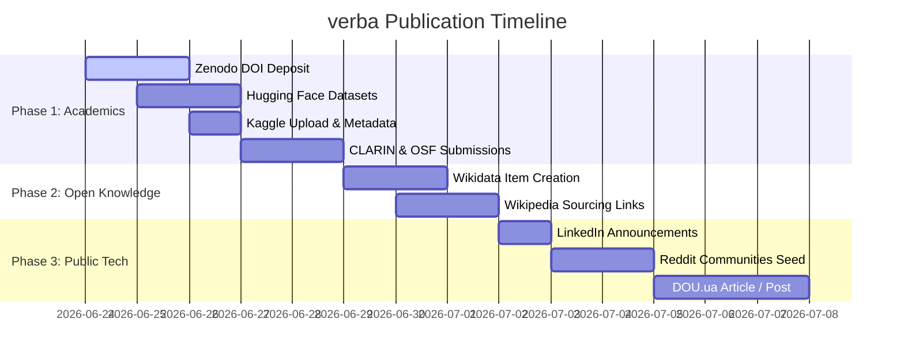

# Publication & Outreach Plan: verba Corpus

This document outlines the step-by-step strategy for publishing the **verba: Ukrainian Proverbs Corpus** to public hubs, academic registries, and professional networks to maximize visibility, research citation, and community adoption.

---

## 1. Hugging Face Datasets (NLP & Machine Learning)

Hugging Face is the premier hub for NLP datasets. Hosting the corpus here will make it indexable by models, researchers, and pipelines.

### A. Repository Setup
1. Create a new dataset repository on Hugging Face: `datasets/dmytro-yemelianov/verba`.
2. Upload the canonical files from the repository:
   * [corpus.csv](file:///home/dmytro/github/ukr-proverbs-corpus/corpus.csv)
   * [sources.csv](file:///home/dmytro/github/ukr-proverbs-corpus/sources.csv)
   * [croissant.json](file:///home/dmytro/github/ukr-proverbs-corpus/croissant.json) (enables one-click loading and dataset explorer preview)
3. Save [DATACARD.md](file:///home/dmytro/github/ukr-proverbs-corpus/DATACARD.md) as the main `README.md` at the root of the Hugging Face repository.

### B. YAML Frontmatter for `README.md`
Add the following YAML block at the very top of `README.md` to feed the Hugging Face metadata index:

```yaml
---
annotations_creators:
- machine-generated
language_creators:
- found
- machine-generated
language:
- uk
license:
- cc-by-4.0
multilinguality:
- monolingual
size_categories:
- 10k<n<100k
source_datasets:
- original
task_categories:
- text-classification
- feature-extraction
task_ids:
- semantic-similarity
- topic-classification
pretty_name: "verba: Ukrainian Proverbs Corpus"
tags:
- linguistics
- cultural-heritage
- paremiology
- historical-spelling
- open-data
dataset_info:
  features:
  - name: id
    dtype: string
  - name: text
    dtype: string
  - name: normalized_text
    dtype: string
  - name: modern_text
    dtype: string
  - name: keyword
    dtype: string
  - name: explanation
    dtype: string
  - name: category
    dtype: string
  - name: sources
    dtype: string
  - name: source_refs
    dtype: string
  - name: variant_group
    dtype: string
  splits:
  - name: train
    num_bytes: 15427267
    num_examples: 48787
---
```

---

## 2. Kaggle (Data Science & Analytics)

Kaggle exposes the dataset to data scientists, analysts, and students looking for raw text mining, graph modeling (variant networks), and NLP tasks.

### A. Repository Setup
1. Create a new dataset on Kaggle: `dmytroyemelianov/verba-ukrainian-proverbs-corpus`.
2. Add [corpus.csv](file:///home/dmytro/github/ukr-proverbs-corpus/corpus.csv) and [sources.csv](file:///home/dmytro/github/ukr-proverbs-corpus/sources.csv).
3. Use the content from [DATACARD.md](file:///home/dmytro/github/ukr-proverbs-corpus/DATACARD.md) for the dataset description.

### B. `dataset-metadata.json`
Include this metadata configuration file to automatically populate Kaggle settings:

```json
{
  "title": "verba: Ukrainian Proverbs Corpus (1841–present)",
  "id": "dmytroyemelianov/verba-ukrainian-proverbs-corpus",
  "licenses": [
    {
      "name": "CC-BY-4.0"
    }
  ],
  "keywords": [
    "linguistics",
    "history",
    "culture",
    "ukrainian",
    "nlp"
  ]
}
```

---

## 3. Zenodo (Academic Indexing & Citable DOI)

Zenodo provides a permanent archive and generates a **digital object identifier (DOI)**, enabling traditional academic citation in papers and indices.

### Deposit Checklist
1. **Upload File:** Create a `.zip` archive containing the release files (such as `verba-corpus-v1.0.2.zip`).
2. **Metadata Fields:**
   * **Upload Type:** Dataset
   * **Title:** `verba: Ukrainian Proverbs Corpus (1841–2009)`
   * **Creators:** `Yemelianov, Dmytro` (Add ORCID: `0009-0002-9244-7426`)
   * **Description:** A brief summary based on the Motivation section of [DATACARD.md](file:///home/dmytro/github/ukr-proverbs-corpus/DATACARD.md).
   * **License:** Creative Commons Attribution 4.0 International (`cc-by-4.0`).
   * **Keywords:** `Ukrainian Language`, `Paremiology`, `Historical Corpora`, `Linguistics`, `Open Data`.
3. **Post-Publishing Action:** Once Zenodo generates the DOI, update [CITATION.cff](file:///home/dmytro/github/ukr-proverbs-corpus/CITATION.cff) and the site's About page with the DOI link.

---

## 4. Professional Outreach (LinkedIn & Tech Community)

Frame this launch as a bridge between engineering (automation, agents, API scaling) and digital humanities (open-source cultural preservation).

### LinkedIn Post Draft (Ukrainian)
> **🚀 Запуск verba — найбільшого відкритого корпусу українських прислів'їв!**
>
> Пареміологія (вивчення прислів’їв та приказок) тривалий час залишалася розпорошеною між друкованими книгами, сканами та закритими базами. Сьогодні я запускаю **verba** — канонічний, відкритий корпус із **48 787 українських прислів'їв**, що охоплює 185 років пареміографії (з 1841 по 2009 рік).
>
> 🔹 **Що всередині?**
> * 5 історичних джерел (зокрема збірки Івана Франка 1901 р. та Матвія Номиса 1864 р.).
> * Оригінальний правопис джерел збережено разом із нормованим сучасним написанням.
> * Тематична розмітка за 27 категоріями.
> * Зв'язки між діалектними та орфографічними варіантами.
>
> 🔹 **Технічний стек:**
> Корпус супроводжується повноцінним REST API на базі Cloudflare Workers, семантичним та лексичним пошуком, генератором інтерактивних GIF/PNG карток для поширення, а також відкритими форматами (JSON, XML, CSV, Croissant) та ліцензією CC BY 4.0.
>
> 🔗 Спробуйте пошук або API: https://verbacorpus.org
> 📁 Код та дані на GitHub: https://github.com/dmytro-yemelianov/verbacorpus
> 🤖 Набір даних на Hugging Face: https://huggingface.co/datasets/dmytro-yemelianov/verba
>
> Буду вдячний за ваші зірочки ⭐ на GitHub та поширення проєкту для дослідників мови, NLP-інженерів та всіх, хто любить українське слово!
>
> #opendata #digitalhumanities #nlp #linguistics #ukrainian #opensource #restapi

### LinkedIn Post Draft (English)
> **🚀 Announcing verba — the largest open corpus of Ukrainian proverbs!**
>
> Sourced from five historical collections spanning 185 years (1841–2009) including Ivan Franko (1901) and Matviy Nomis (1864), **verba** consolidates **48,787 entries** into a unified, open-access, citable digital resource.
>
> 🔹 **Key Features:**
> * Preservation of original historical spelling alongside modern standard spelling.
> * Rich annotation with a 27-theme taxonomy.
> * Heuristic grouping of dialectal variants.
> * Full metadata support (BibTeX, CSL-JSON, MLCommons Croissant, CC BY 4.0 license).
>
> 🔹 **API & Web App:**
> Powered by Cloudflare Workers, the platform serves a high-performance REST API supporting keyword, category, and vector-semantic search, alongside automated animated share cards.
>
> 🔗 Explore the corpus: https://verbacorpus.org
> 📁 Open Source code/data: https://github.com/dmytro-yemelianov/verbacorpus
> 🤗 Dataset on Hugging Face: https://huggingface.co/datasets/dmytro-yemelianov/verba
>
> Sincere thanks to everyone supporting Ukrainian cultural preservation and language technology. Contributions, stars ⭐, and research collaborations are very welcome!
>
> #opendata #digitalhumanities #nlp #linguistics #ukrainian #opensource #restapi

### LinkedIn Post Draft — Hugging Face release (Ukrainian)

> **🤗 verba тепер на Hugging Face — 48 787 українських прислів'їв за один рядок коду**
>
> Корпус **verba** опубліковано як відкритий набір даних на Hugging Face — найбільшому хабі для NLP та машинного навчання. Тепер найбільше відкрите зібрання українських прислів'їв доступне дослідникам і розробникам без реєстрації, ключів і ручного завантаження файлів.
>
> ```python
> from datasets import load_dataset
> ds = load_dataset("dmytro-yemelianov/verba", split="train")  # 48 787 прислів'їв
> ```
>
> 🔹 **Що в наборі:**
> * 48 787 записів із 5 історичних зібрань (1841–2009), зокрема Франко (1901) та Номис (1864).
> * Оригінальний правопис джерел поряд із нормованим сучасним написанням.
> * Тематична розмітка за 27 категоріями та зв'язки між діалектними варіантами.
> * Метадані Croissant, ліцензія CC BY 4.0, повна карта даних.
>
> 🔹 **Як працювати:** бібліотека `datasets`, `pandas` прямо з хабу, CLI `hf` або SQL-запити через DuckDB — без скачування всього файлу.
>
> 🔗 Набір даних: https://huggingface.co/datasets/dmytro-yemelianov/verba
> 📖 Покрокова інструкція: https://verbacorpus.org/blog/verba-na-hugging-face
> 🌐 Пошук і API: https://verbacorpus.org
>
> Буду вдячний за ⭐ і поширення серед мовознавців, NLP-інженерів та всіх, хто любить українське слово!
>
> #opendata #nlp #huggingface #linguistics #ukrainian #opensource #digitalhumanities

### Telegram Post Draft — Ukrainian data science / NLP community

> 🇺🇦 **verba — найбільший відкритий корпус українських прислів'їв тепер на Hugging Face**
>
> 48 787 прислів'їв із 5 історичних зібрань (1841–2009) — готовий датасет для NLP та ML. Без реєстрації, ключів і ручного завантаження файлів.
>
> ```python
> from datasets import load_dataset
> ds = load_dataset("dmytro-yemelianov/verba", split="train")  # 48 787 рядків × 10 колонок
> ```
>
> 🔹 **Що всередині**
> • `text` — оригінальний правопис джерела + `modern_text` — сучасне написання
> • `category` — 27 тем (1–3 на запис), `variant_group` — діалектні/орфографічні варіанти
> • `explanation` — наукові пояснення (Франко), `sources` — атрибуція джерела
> • Формати: CSV / JSON / JSONL / XML / Parquet + метадані Croissant
>
> 🔹 **Як працювати**
> • `datasets`, `pandas` (`hf://…`), CLI `hf`
> • DuckDB SQL прямо по Parquet — без завантаження всього файлу
> • REST API + семантичний пошук (bge-m3 + Cloudflare Vectorize): `verbacorpus.org/api/v1`
>
> 🔹 **Для чого**
> • fine-tuning моделей під український фольклор, ідіоми, історичну лексику
> • нормалізація історичного правопису, діахронічний аналіз (1841→сьогодні)
> • ембединги, семантичний пошук, text/topic classification
>
> 📦 Датасет: https://huggingface.co/datasets/dmytro-yemelianov/verba
> 📖 Гайд із прикладами: https://verbacorpus.org/blog/verba-na-hugging-face
> 🌐 Пошук і API: https://verbacorpus.org
> ⭐ GitHub: https://github.com/dmytro-yemelianov/verbacorpus
>
> Ліцензія: CC BY 4.0 (упорядкування + збагачення); історичні тексти — public domain.
>
> #NLP #MachineLearning #OpenData #Ukrainian #HuggingFace #DataScience

---

## 5. Other Reasonable Channels & Registry Suggestion

To deeply anchor the dataset in linguistic and open-source networks, submit it to these additional resources:

### A. Academic & Linguistic Registries
1. **CLARIN (Common Language Resources and Technology Infrastructure):**
   * Submit to the CLARIN-PL or general CLARIN repository (the European infrastructure for language resources). This puts the dataset on the radar of European academic networks.
   * Format the submission utilizing the generated `croissant.json` or the XML metadata export.
2. **Open Science Framework (OSF):**
   * Create an OSF project space pointing to the Zenodo DOI, GitHub code, and Hugging Face repositories. This is highly trusted in DH (Digital Humanities) circles.
3. **Papers With Code:**
   * Link the Hugging Face dataset and GitHub repo to the *Ukrainian NLP* task page under the "Datasets" category.

### B. Tech & Open Knowledge Networks
1. **Wikidata:**
   * Create a Wikidata Item for the corpus (e.g. `instance of: linguistic corpus`, `languages: uk`, `license: CC-BY-4.0`, `official website: https://verbacorpus.org`).
   * Link the five core historical sources (e.g. Franko's 1901 collection) to the Wikidata item to build out the semantic web graph.
2. **DOU.ua (Ukrainian Tech Community):**
   * Publish a short blog post or forum thread on DOU.ua detailing the technical challenges: engineering the ingestion pipeline, scanning double-column historical OCR tables from 1864, using LLM agents for categorical alignment, and deploying the serverless Cloudflare Workers stack.
3. **Reddit Channels:**
   * `r/Ukrainian` — target language learners/diaspora with the interactive site search and social share cards.
   * `r/datasets` — target open data collectors with the CSV/Croissant formats.
   * `r/LanguageTechnology` — target NLP engineers with the vector search details and API endpoints.

---

## 6. Phased Rollout Schedule


